# Xenon Language Documentation

Welcome to the Xenon language documentation repository. This project aims to provide comprehensive documentation for the Xenon programming language, including its syntax, compilation process, security features, and more.

## Table of Contents

- [Requirements](src/requirements.md)
- [Comparative Study](src/comparative_study.md)
- [Syntax](src/syntax.md)
- [Compilation Process](src/compilation_process.md)
- [Optimizer](src/optimizer.md)
- [Interpreter](src/interpreter.md)
- [BNF](src/xenon.bnf)
- [Inspirations](src/inspirations.md)
- [Security Features](src/security_features.md)

## Overview

Xenon is a programming language inspired by Rust, designed with a focus on simplicity, safety and performance. It compiles to WebAssembly (Wasm) for efficient execution across various platforms.

## Getting Started

To get started with Xenon, please refer to the [Requirements](src/requirements.md) section to set up your development environment.

## Documentation

The documentation is divided into several sections:

- **Requirements**: Details the software and system requirements for developing with Xenon.
- **Comparative Study**: Analyzes the decisions made during the development of Xenon.
- **Syntax**: Provides an overview of the language syntax with examples.
- **Compilation Process**: Describes the stages involved in compiling Xenon code to WebAssembly.
- **BNF**: Contains the Backus-Naur Form (BNF) grammar for Xenon.
- **Inspirations**: Discusses the inspirations behind Xenon's design, particularly from Rust.
- **Security Features**: Outlines the security features implemented in the Xenon compiler.

## Building the Documentation

To build the documentation, you can use `mdBook`. Follow these steps:

1. Install `mdBook`:
    ```sh
    cargo install mdbook
    ```

2. Build the documentation:
    ```sh
    mdbook build
    ```

3. Serve the documentation locally:
    ```sh
    mdbook serve
    ```

The documentation will be available at `http://localhost:3000`.

## Compilation Process (Mermaid Diagram)

```mermaid
graph TD
    style A fill:#ff99ff,stroke:#333333,stroke-width:4px
    style B fill:#99bbff,stroke:#333333,stroke-width:4px
    style C fill:#ffbb99,stroke:#333333,stroke-width:4px
    style D fill:#9f9,stroke:#333,stroke-width:4px
    style E fill:#ffb,stroke:#333,stroke-width:4px
    style F fill:#f99,stroke:#333,stroke-width:4px
    style G fill:#bbb,stroke:#333,stroke-width:4px
    style H fill:#c9f,stroke:#333,stroke-width:4px
    style S fill:#bbb,stroke:#333,stroke-width:4px

    subgraph Compilation Process
        S["<b style='color:black'>Source Code</b><br/><span style='color:black'>.xn source file</span>"] -->|Source File| A["<b style='color:black'>Lexer</b><br/><span style='color:black'>Converts source code to tokens</span>"]
        A -->|Token Stream| B["<b style='color:black'>Parser</b><br/><span style='color:black'>Generates Abstract Syntax Tree</span>"]
        B -->|Abstract Syntax Tree| C["<b style='color:black'>Semantic Analyzer</b><br/><span style='color:black'>Checks types and logic</span>"]
        C -->|Validated AST| D["<b style='color:black'>Optimizer</b><br/><span style='color:black'>Optimizes and simplifies code</span>"]
        D -->|Optimized AST| E["<b style='color:black'>Fill WASM Module Data</b><br/><span style='color:black'>Prepares WASM structure</span>"]
        E -->|WASM Module Structure| F["<b style='color:black'>Write WASM</b><br/><span style='color:black'>Encodes final binary</span>"]
        F -->|WASM Binary| G["<b style='color:black'>WASM VM</b><br/><span style='color:black'>Executes the binary</span>"]
        D -->|Optimized AST| H["<b style='color:black'>Interpreter</b><br/><span style='color:black'>Interprete xenon code</span>"]
    end
```



If you want more details about the compilation process, please refer to the [Compilation Process](src/compilation_process.md) section.