## Compilation Process Documentation

This document outlines the various stages involved in the compilation process of the Xenon language, from parsing the source code to generating the final WebAssembly (WASM) binary.

### 1. Lexer

The lexer is responsible for converting the raw source code into a stream of tokens. Tokens are the basic building blocks of the language, such as keywords, identifiers, literals, and operators.

### 2. Parser

The parser takes the stream of tokens produced by the lexer and constructs an Abstract Syntax Tree (AST). The AST represents the hierarchical structure of the source code.

### 3. Semantic Analyzer

The semantic analyzer checks the AST for semantic errors, such as type mismatches, undeclared variables, and other logical errors. It ensures that the program adheres to the language's rules.

### 4. Optimizer

The optimizer runs pre-computation steps to evaluate constant expressions, unwrap and remove branches of code that are guaranteed to be/will never be executed and perform loop unrolling where applicable.

More details about the optimization steps on the [here](optimizer.md)

### 5. Fill WASM Module Data

The Fill WASM Module Data module is responsible for converting the IR into a WASM module structure. This involves collecting types, functions, globals, and other sections required for the WASM binary.

### 6. Write WASM

The Write WASM module encodes the WASM module structure into a binary format that can be executed by a WASM runtime. This involves encoding various sections such as types, functions, exports, and code.

## Compilation Process (Mermaid Diagram)

```mermaid
graph TD
    style A fill:#f9f,stroke:#333,stroke-width:4px
    style B fill:#bbf,stroke:#333,stroke-width:4px
    style C fill:#fb9,stroke:#333,stroke-width:4px
    style D fill:#9f9,stroke:#333,stroke-width:4px
    style E fill:#ffb,stroke:#333,stroke-width:4px
    style F fill:#f99,stroke:#333,stroke-width:4px
    style G fill:#bbb,stroke:#333,stroke-width:4px

    subgraph Compilation Process
        A["<b style='color:black'>Lexer</b><br/><span style='color:black'>Converts source code to tokens</span>"] -->|Token Stream| B["<b style='color:black'>Parser</b><br/><span style='color:black'>Generates Abstract Syntax Tree</span>"]
        B -->|Abstract Syntax Tree| C["<b style='color:black'>Semantic Analyzer</b><br/><span style='color:black'>Checks types and logic</span>"]
        C -->|Validated AST| D["<b style='color:black'>Optimizer</b><br/><span style='color:black'>Optimizes and simplifies code</span>"]
        D -->|Optimized AST| E["<b style='color:black'>Fill WASM Module Data</b><br/><span style='color:black'>Prepares WASM structure</span>"]
        E -->|WASM Module Structure| F["<b style='color:black'>Write WASM</b><br/><span style='color:black'>Encodes final binary</span>"]
        F -->|WASM Binary| G["<b style='color:black'>WASM VM</b><br/><span style='color:black'>Executes the binary</span>"]
    end
```

