# Interpreter

The Xenon Interpreter allows you to run Xenon code without the need to compile it beforehand.  Whether or not you should compile or interpret your code depends on your specific needs:

 **Compiled**
- **Execution speed**: Running compiled code is generally faster as there isn't the overhead that comes with interpreting code.
- **Program encapsulation**: If your program is specifically made to execute a single task, it may be more appropriate to compile your code.

**Interpreted**
- **Quick Usage**: Using an interpreter is quite useful when you need to execute some small code with varying input on the fly.
- **Control**: Interpreters usually offer some additional features that allow you interact with your program in a way you cannot with compiled code. The Xenon Interpreter offers those features in the form of [Commands](#Commands).
## Usage

If not already done, you'll need to clone the [Xenon repository](https://github.com/Xenon-Lang-Org/Xenon) and build the interpreter (`xin`).

Then, simply run the program:

```sh
./xin
```

To run a single file without starting the command line interface, use the `-e` flag. Note that this execution mode will print the output of functions onto the terminal.

```sh
./xin -e main.xn
```

You can also pre-load Xenon files while launching it:

```sh
./xin foo.xn bar.xn
```

You'll then be put into a command line interface where can write the code. It supports standard CLI input features such as line editing and command history. When writing a single statement, you do not have to terminate it by a semicolon.

```
Xenon Interpreter x.x.x
Type '/help' for a list of commands.
>> [YOUR COMMAND]
```


**Note**: The interpreter does not support redirecting multiple lines of code into it when running it (i.e. `./xin < foo.xn`). If you need to declare a complex multi-line construct like a function that cannot be written in a single line, you can write it into a file and load it into the interpreter.
## Commands

When in the CLI, you can enter special commands to interact with the live execution.
All commands must be prefixed with `/` to be recognized.

- `env`: Lookup data from the virtual environment (variables, functions and custom types), using it without any argument will dump the entire environment. Adding any number of argument will only show the ones that match them.
- `load`: Load xenon files into the virtual environment. Each given argument must be a path to a valid xenon file. If not arguments are given, this command is a no op. Loading a Xenon file into the interpreter will import all of its variables, functions and custom types (**Note**: this will also execute all standalone statments like function calls and variable reassignments)
- `exit`: Exit the interpreter.
- `help`: Print a list of commands.

## Interpreter process (Mermaid Diagram)

```mermaid
graph TD
    style A fill:#f9f,stroke:#333,stroke-width:4px
    style B fill:#bbf,stroke:#333,stroke-width:4px
    style C fill:#fb9,stroke:#333,stroke-width:4px
    style D fill:#9f9,stroke:#333,stroke-width:4px
    style E fill:#ffb,stroke:#333,stroke-width:4px
    style F fill:#f99,stroke:#333,stroke-width:4px
    style G fill:#bbb,stroke:#333,stroke-width:4px
    style H fill:#c9f,stroke:#333,stroke-width:4px
    style S fill:#bbb,stroke:#333,stroke-width:4px

    subgraph Interpreter process
        S["<b style='color:black'>Source Code</b><br/><span style='color:black'>.xn source file</span>"] -->|Source File| A["<b style='color:black'>Lexer</b><br/><span style='color:black'>Converts source code to tokens</span>"]
        A -->|Token Stream| B["<b style='color:black'>Parser</b><br/><span style='color:black'>Generates Abstract Syntax Tree</span>"]
        B -->|Abstract Syntax Tree| C["<b style='color:black'>Semantic Analyzer</b><br/><span style='color:black'>Checks types and logic</span>"]
        C -->|Validated AST| D["<b style='color:black'>Optimizer</b><br/><span style='color:black'>Optimizes and simplifies code</span>"]
        D -->|Optimized AST| E["<b style='color:black'>Fill WASM Module Data</b><br/><span style='color:black'>Prepares WASM structure</span>"]
        E -->|WASM Module Structure| F["<b style='color:black'>Write WASM</b><br/><span style='color:black'>Encodes final binary</span>"]
        F -->|WASM Binary| G["<b style='color:black'>WASM VM</b><br/><span style='color:black'>Executes the binary</span>"]
        D -->|Optimized AST| H["<b style='color:black'>Interpreter</b><br/><span style='color:black'>Interprete xenon code</span>"]
    end
```

